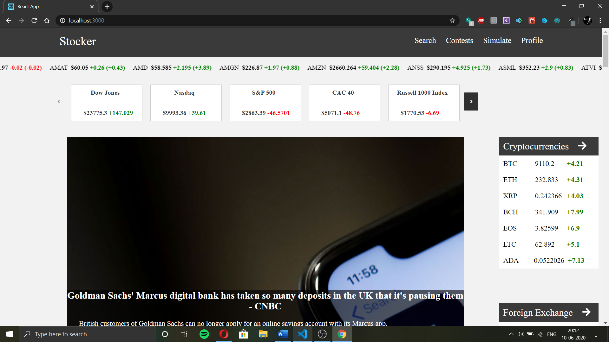
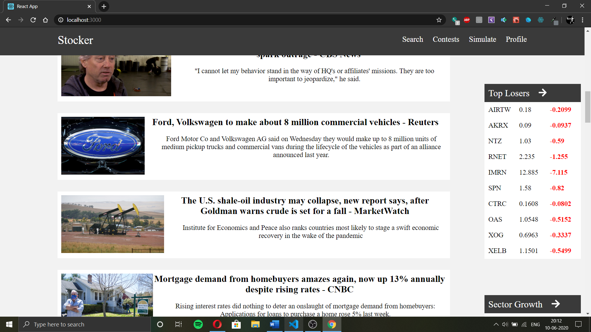
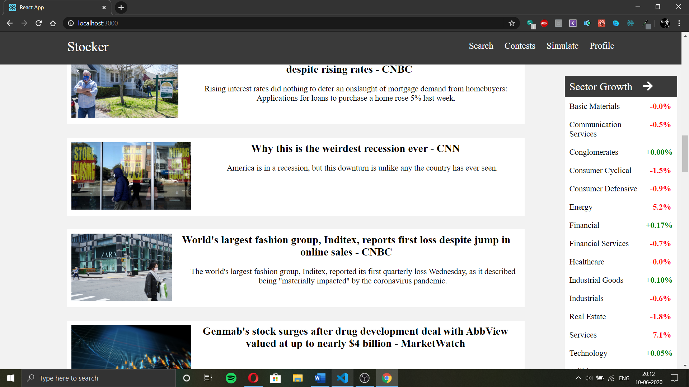

# Stocker

Stocker is a frontend stockmarket tracking app which provides real time stock market data and analysis. 

Tools Used:
-----------
  This app was implemented in React.js.

&ensp;&ensp;

